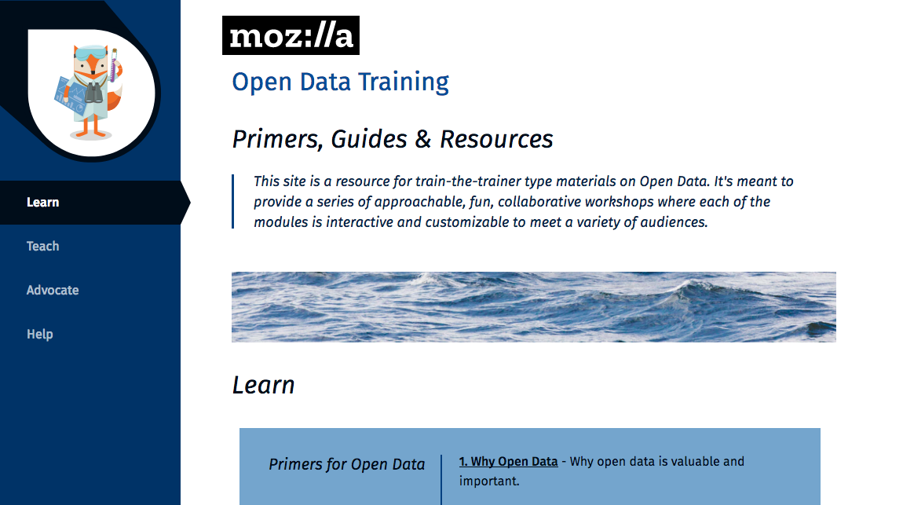

# Open Data Primers

Welcome to the [@MozillaScience](https://twitter.com/mozillascience) Lab's collection of instructor guides to train people in open data use/reuse.

  
Open Data Instructor Guides by <a xmlns:cc="http://creativecommons.org/ns#" href="https://science.mozilla.org/" property="cc:attributionName" rel="cc:attributionURL">Mozilla Science Lab</a> is licensed under a <a rel="license" href="http://creativecommons.org/licenses/by/4.0/">Creative Commons Attribution 4.0 International License</a>. Based on a work at <a xmlns:dct="http://purl.org/dc/terms/" href="https://github.com/mozillascience/open-data-guides/" rel="dct:source">https://github.com/mozillascience/open-data-guides/</a>. Permissions beyond the scope of this license may be available at <a xmlns:cc="http://creativecommons.org/ns#" href="https://www.mozilla.org/en-US/foundation/licensing/" rel="cc:morePermissions">https://www.mozilla.org/en-US/foundation/licensing/</a>.
